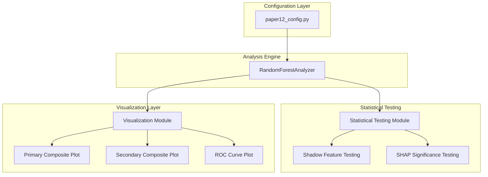

# Design Document

## Overview

This design document outlines the architecture for enhancing the Random Forest pipeline with unified configuration management, robust statistical significance testing for feature importance, and improved publication-ready visualizations. The enhancement maintains backward compatibility while adding sophisticated statistical rigor and professional visualization capabilities.

The design follows a modular approach where each enhancement can be developed and tested independently, ensuring minimal disruption to existing functionality while providing comprehensive improvements to the analysis pipeline.

## Architecture

### System Components



### Configuration Integration Architecture

The configuration system will be consolidated into a single source of truth in `paper12_config.py`. The existing `RFAnalysisConfig` from `rf_config.py` will be merged into the `paper2_rf_config` class, maintaining all existing functionality while eliminating duplication.

**Configuration Hierarchy:**
- `master_config`: Top-level container
- `paper2_rf_config`: Enhanced RF analysis configuration (merged from RFAnalysisConfig)
- Existing configurations: Preserved for backward compatibility

## Components and Interfaces

### 1. Enhanced Configuration Management

**Class: `paper2_rf_config` (Enhanced)**
```python
@dataclass
class paper2_rf_config:
    # Existing fields preserved
    analysis_name: str
    outcome_variable: str
    model_type: str
    predictors: List[str]
    covariates: List[str]
    
    # Statistical testing configuration
    enable_gini_significance: bool = True
    enable_shap_significance: bool = True
    significance_alpha: float = 0.05
    
    # Visualization configuration
    figure_width_primary: float = 16.0
    figure_height_primary: float = 10.0
    figure_width_secondary: float = 16.0
    figure_height_secondary: float = 10.0
    max_features_display: Optional[int] = None  # None = show all
    
    # Existing fields...
```

### 2. Statistical Testing Module

**Class: `FeatureImportanceSignificanceTester`**

This module implements both shadow feature testing for Gini importance and Wilcoxon signed-rank testing for SHAP values.

**Key Methods:**
- `test_gini_significance()`: Implements shadow feature permutation testing
- `test_shap_significance()`: Implements Wilcoxon signed-rank testing with FDR correction
- `create_shadow_features()`: Generates permuted shadow features
- `calculate_significance_threshold()`: Determines cutoff from shadow features

**Shadow Feature Testing Algorithm:**
1. Create shadow dataset by shuffling each feature independently
2. Rename shadow features with "_shadow" suffix
3. Combine original and shadow features into augmented dataset
4. Train Random Forest on augmented dataset
5. Extract importance scores for all features
6. Use maximum shadow feature importance as significance threshold
7. Mark original features exceeding threshold as significant

**SHAP Significance Testing Algorithm:**
1. Calculate SHAP values for all test instances
2. For each feature, perform one-sample Wilcoxon signed-rank test
3. Test null hypothesis: median SHAP value = 0
4. Collect p-values for all features
5. Apply Benjamini-Hochberg FDR correction using existing utilities
6. Compare adjusted p-values to significance level (α = 0.05)

### 3. Enhanced Visualization Module

**Class: `EnhancedFeatureImportancePlotter`**

This module creates publication-ready composite plots with proper statistical annotations.

**Primary Composite Plot (2 panels):**
- Left Panel: Gini importance with significance threshold line
- Right Panel: SHAP beeswarm with significance annotations

**Secondary Composite Plot (2 panels):**
- Left Panel: Mean absolute SHAP values
- Right Panel: Permutation importance

**Key Design Decisions:**
- Dynamic figure sizing based on number of features
- Consistent feature ordering across panels
- Clear significance indicators (dashed lines, asterisks)
- Professional typography and color schemes
- No feature collapsing - all features displayed

### 4. Integration with Existing Engine

**Enhanced `RandomForestAnalyzer` Class:**

The existing analyzer will be extended with new methods while preserving all current functionality:

**New Methods:**
- `_test_feature_significance()`: Orchestrates significance testing
- `_plot_primary_composite()`: Creates Gini + SHAP beeswarm plot
- `_plot_secondary_composite()`: Creates mean SHAP + permutation plot
- `_annotate_significance()`: Adds significance markers to plots

**Modified Methods:**
- `run_and_generate_outputs()`: Updated to call new plotting methods
- Constructor: Updated to accept enhanced configuration

## Data Models

### Statistical Results Storage

```python
@dataclass
class SignificanceResults:
    """Container for feature importance significance test results."""
    
    # Gini significance results
    gini_threshold: float
    gini_significant_features: List[str]
    shadow_importances: Dict[str, float]
    
    # SHAP significance results  
    shap_pvalues: Dict[str, float]
    shap_adjusted_pvalues: Dict[str, float]
    shap_significant_features: List[str]
    
    # Metadata
    alpha_level: float
    n_features_tested: int
    n_shadow_features: int
```

### Enhanced Results Dictionary

The existing `self.results` dictionary will be extended:

```python
self.results = {
    # Existing results preserved
    'gini_importance': pd.Series,
    'permutation_importance': pd.Series,
    'shap_explanation': shap.Explanation,
    
    # New significance results
    'significance_results': SignificanceResults,
    'feature_ordering': List[str],  # Canonical ordering for plots
}
```

## Error Handling

### Robust Statistical Testing

**Shadow Feature Testing Error Handling:**
- Insufficient data: Fall back to standard Gini importance without significance
- Memory constraints: Reduce shadow feature count with warning
- Model training failure: Log error and continue with original features

**SHAP Significance Testing Error Handling:**
- SHAP calculation failure: Skip significance testing, use standard SHAP plots
- Statistical test failure: Log warning and mark features as "not tested"
- FDR correction failure: Use raw p-values with warning

### Visualization Error Handling

**Plot Generation Error Handling:**
- Figure size constraints: Automatically adjust dimensions
- Feature name length issues: Truncate with ellipsis
- Color mapping failures: Fall back to default color scheme
- Save operation failures: Log error but continue execution

### Configuration Validation

**Enhanced Validation:**
- Validate significance testing parameters
- Check visualization configuration bounds
- Ensure backward compatibility with existing configs
- Provide informative error messages for invalid settings

## Testing Strategy

### Unit Testing Approach

**Configuration Testing:**
- Test configuration merging and validation
- Verify backward compatibility with existing configs
- Test error handling for invalid configurations

**Statistical Testing Module:**
- Test shadow feature generation with known datasets
- Verify Wilcoxon test implementation with synthetic data
- Test FDR correction integration
- Validate significance threshold calculations

**Visualization Module:**
- Test plot generation with various feature counts
- Verify significance annotation placement
- Test figure sizing algorithms
- Validate color schemes and typography

### Integration Testing

**End-to-End Pipeline Testing:**
- Test complete pipeline with real WGC dataset
- Verify output file generation and naming
- Test memory usage with large feature sets
- Validate statistical results consistency

**Backward Compatibility Testing:**
- Ensure existing analysis configurations still work
- Verify output format consistency
- Test migration from old to new configuration format

### Performance Testing

**Statistical Testing Performance:**
- Benchmark shadow feature testing with various dataset sizes
- Test SHAP significance calculation scalability
- Monitor memory usage during augmented dataset training

**Visualization Performance:**
- Test plot generation time with large feature sets
- Verify figure quality at different DPI settings
- Test save operation performance

## Implementation Phases

### Phase 1: Configuration Integration
1. Merge RFAnalysisConfig into paper2_rf_config
2. Update rf_engine.py imports and initialization
3. Add enhanced configuration validation
4. Remove rf_config.py after migration
5. Test backward compatibility

### Phase 2: Statistical Testing Implementation
1. Implement FeatureImportanceSignificanceTester class
2. Add shadow feature generation and testing
3. Implement SHAP significance testing with FDR correction
4. Integrate with existing RandomForestAnalyzer
5. Add comprehensive error handling

### Phase 3: Enhanced Visualization
1. Implement EnhancedFeatureImportancePlotter class
2. Create primary composite plot (Gini + SHAP beeswarm)
3. Create secondary composite plot (mean SHAP + permutation)
4. Add significance annotations and styling
5. Integrate with analyzer output pipeline

### Phase 4: Integration and Testing
1. Update run_and_generate_outputs() method
2. Implement comprehensive testing suite
3. Performance optimization and memory management
4. Documentation and example usage
5. Final validation with real datasets

This phased approach ensures each component can be developed, tested, and validated independently while maintaining system stability throughout the enhancement process.