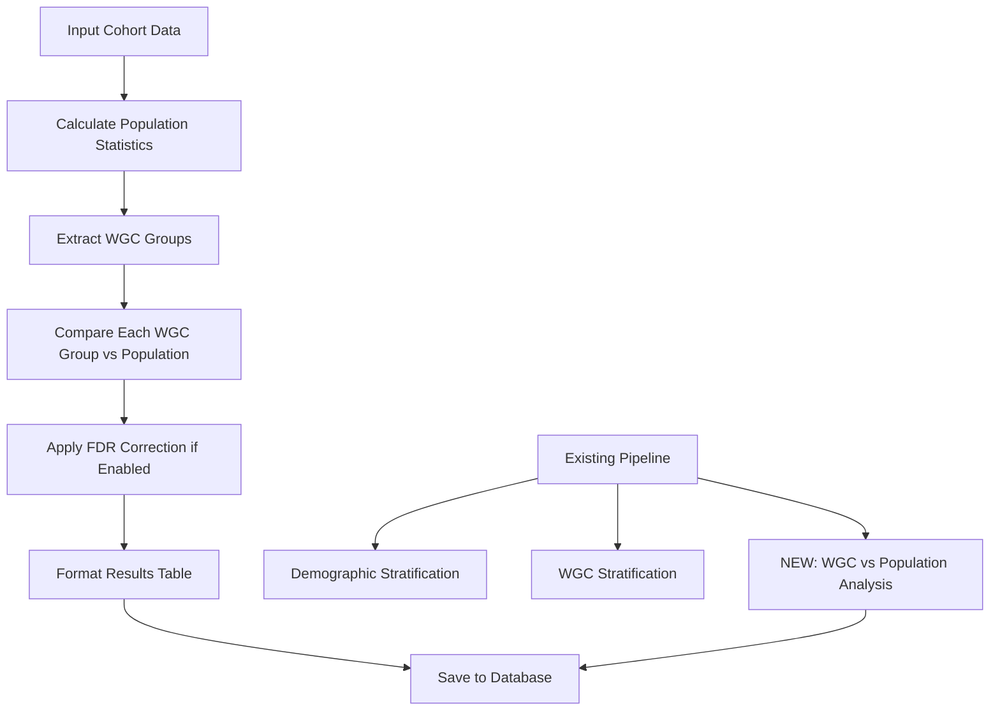

# Design Document

## Overview

This design extends the existing descriptive analysis pipeline by adding a new WGC vs Population Mean comparison functionality. The new feature will create tables comparing each Weight Gain Cause (WGC) group against the population mean, following the established patterns in the current `descriptive_comparisons.py` module.

The implementation will add a new function `wgc_vs_population_mean_analysis()` that integrates seamlessly with the existing pipeline architecture, using the same statistical methods, formatting functions, and FDR correction utilities already established in the codebase.

## Architecture

### Integration Points

The new functionality integrates with the existing pipeline at these key points:

1. **Main Pipeline Function**: `run_descriptive_comparisons()` will call the new analysis function alongside existing demographic and WGC stratification functions
2. **Configuration**: Uses the existing `descriptive_comparisons_config` dataclass without requiring new configuration parameters
3. **Database**: Creates new tables in the same output database used by existing analyses
4. **Statistical Methods**: Leverages existing `perform_comparison()`, `welchs_ttest()`, and `categorical_pvalue()` functions
5. **FDR Correction**: Uses the existing FDR correction utilities from `fdr_correction_utils.py`

### Data Flow



## Components and Interfaces

### New Function: `wgc_vs_population_mean_analysis()`

**Signature:**
```python
def wgc_vs_population_mean_analysis(df: pd.DataFrame, config: descriptive_comparisons_config, conn: sqlite3.Connection) -> None
```

**Parameters:**
- `df`: Input cohort DataFrame containing all variables and WGC indicators
- `config`: Existing descriptive_comparisons_config object with row_order, wgc_strata, and fdr_correction settings
- `conn`: SQLite database connection for saving results

**Responsibilities:**
1. Calculate population-level statistics (mean±std for continuous, n(%) for categorical)
2. Extract WGC groups based on config.wgc_strata
3. Compare each WGC group against population using existing statistical methods
4. Apply FDR correction if config.fdr_correction is enabled
5. Format results according to specified table structure
6. Save results to database with naming convention '[input_cohort]_wgc_strt_vs_mean'

### Table Structure Design

**Column Layout:**
1. `Variable` - Variable names with pretty formatting from row_order
2. `Population Mean (±SD) or N (%)` - Population baseline statistics
3. For each WGC group (e.g., "Mental Health"):
   - `Mental Health: Mean/N` - WGC group statistics
   - `Mental Health: p-value` - Raw p-value from statistical test
   - `Mental Health: p-value (FDR-corrected)` - FDR-corrected p-value (only if FDR enabled)

**Dynamic Column Generation:**
The function will dynamically generate columns based on the WGC groups defined in `config.wgc_strata`, ensuring flexibility for different analysis configurations.

### Integration with Existing Pipeline

**Modified `run_descriptive_comparisons()` function:**
```python
# After existing stratifications
with sqlite3.connect(output_db_path) as conn_out:
    demographic_stratification(df_input, df_mother, analysis_config, conn_out)
    wgc_stratification(df_input, analysis_config, conn_out)
    # NEW: Add WGC vs population mean analysis
    wgc_vs_population_mean_analysis(df_input, analysis_config, conn_out)
```

## Data Models

### Input Data Structure
- Uses existing DataFrame structure from time-to-event tables
- Requires WGC indicator columns (binary 0/1 values)
- Supports all variable types currently handled by the pipeline

### Output Table Schema
```sql
CREATE TABLE [cohort_name]_wgc_strt_vs_mean (
    Variable TEXT,
    "Population Mean (±SD) or N (%)" TEXT,
    "[WGC1_Name]: Mean/N" TEXT,
    "[WGC1_Name]: p-value" REAL,
    "[WGC1_Name]: p-value (FDR-corrected)" REAL,  -- Only if FDR enabled
    "[WGC2_Name]: Mean/N" TEXT,
    "[WGC2_Name]: p-value" REAL,
    "[WGC2_Name]: p-value (FDR-corrected)" REAL,  -- Only if FDR enabled
    -- ... continues for all WGC groups
);
```

### Statistical Comparison Logic

**Population vs WGC Group Comparison:**
- Population: All records in the input cohort DataFrame
- WGC Group: Records where the specific WGC indicator = 1
- Comparison: WGC Group vs Population (including the WGC group itself)

**Alternative Approach (for consideration):**
- Population: All records where the specific WGC indicator = 0 (non-WGC group)
- WGC Group: Records where the specific WGC indicator = 1
- This would provide a cleaner "WGC vs non-WGC" comparison

## Error Handling

### Data Quality Issues
1. **Missing Variables**: Skip variables not present in DataFrame, log warning
2. **Insufficient Data**: Return NaN for statistical tests with insufficient sample sizes
3. **Empty WGC Groups**: Display "N/A" for groups with no members
4. **Statistical Test Failures**: Catch exceptions, log warnings, continue processing

### Database Operations
1. **Connection Failures**: Propagate exceptions to calling function
2. **Table Creation Failures**: Provide informative error messages
3. **Transaction Management**: Use existing connection management patterns

### FDR Correction Robustness
1. **No Valid P-values**: Skip FDR correction, log warning
2. **Insufficient P-values**: Apply correction with warning about limited data
3. **Correction Failures**: Fall back to raw p-values, log error

## Testing Strategy

### Unit Testing Approach
1. **Statistical Functions**: Test comparison logic with known datasets
2. **Formatting Functions**: Verify correct mean±std and n(%) formatting
3. **Column Generation**: Test dynamic column creation for different WGC configurations
4. **Edge Cases**: Test with empty groups, missing data, single-value variables

### Integration Testing
1. **Pipeline Integration**: Verify function executes within existing pipeline
2. **Database Operations**: Test table creation and data insertion
3. **FDR Correction**: Test with and without FDR correction enabled
4. **Configuration Compatibility**: Test with different descriptive_comparisons_config setups

### Data Validation
1. **Statistical Accuracy**: Compare results with manual calculations
2. **Table Structure**: Verify column names and ordering match specification
3. **Cross-Analysis Consistency**: Ensure results align with existing stratification analyses where applicable

## Implementation Considerations

### Code Reuse Strategy
- Leverage existing `format_mean_sd()`, `format_n_perc()` functions for consistent formatting
- Use existing `perform_comparison()` function for statistical testing
- Utilize existing `get_cause_cols()` and `get_variable_types()` helper functions
- Apply existing FDR correction utilities without modification

### Performance Considerations
- Process variables iteratively to manage memory usage
- Use vectorized pandas operations where possible
- Minimize database transactions by building complete DataFrame before insertion

### Maintainability
- Follow existing code patterns and naming conventions
- Use comprehensive logging consistent with current pipeline
- Maintain backward compatibility with existing configurations
- Document function parameters and return values following existing style